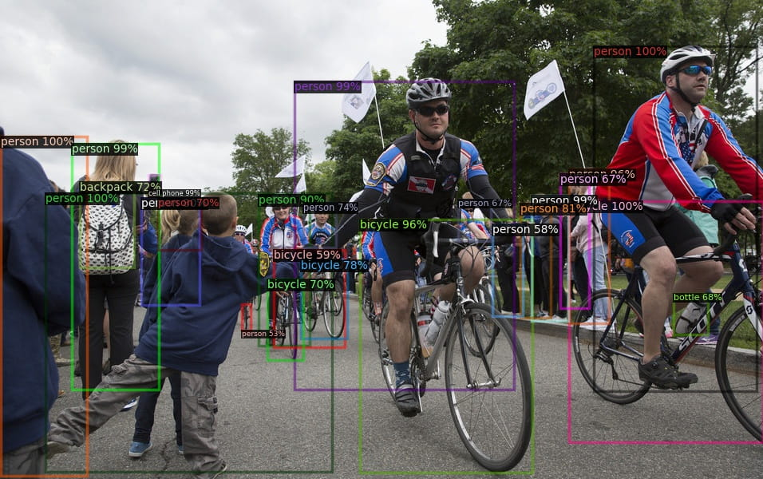
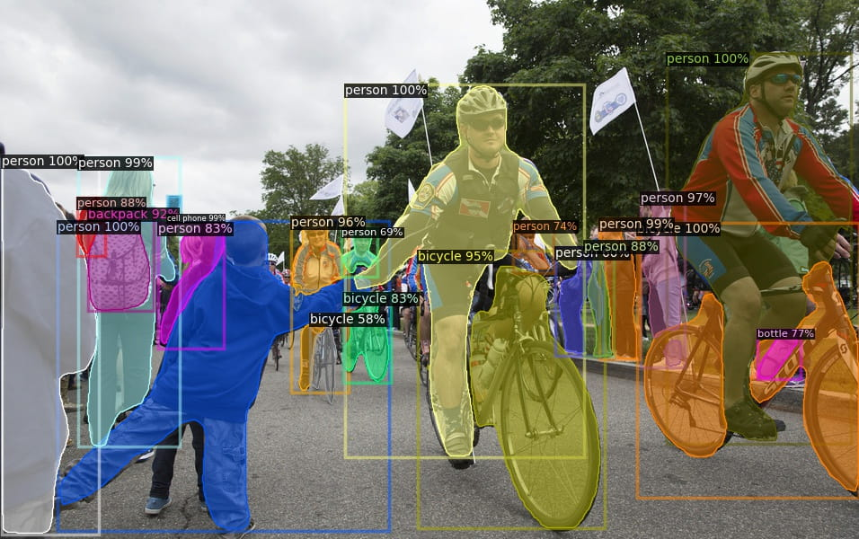
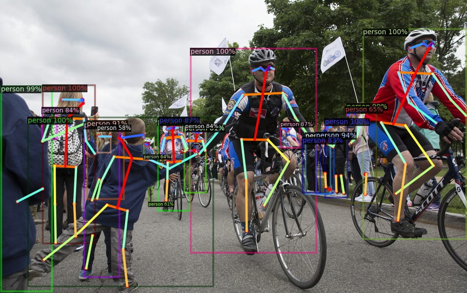
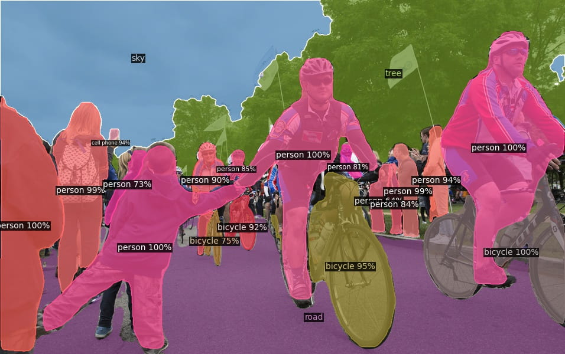
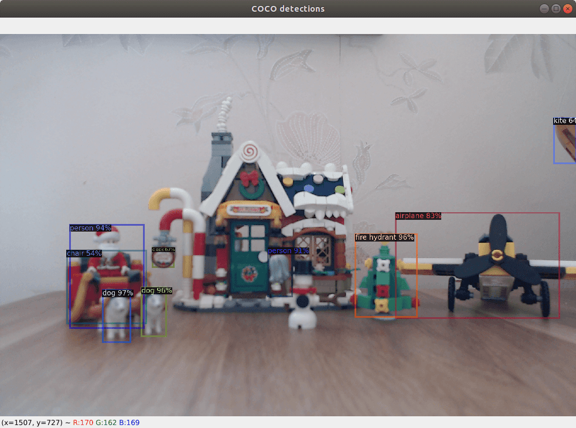

# [Detectron2][]

[Detectron2]: https://github.com/facebookresearch/detectron2

## Installation

- [Installation](https://detectron2.readthedocs.io/tutorials/install.html)

```bash
conda create -n detectron2 python=3.8 -y
conda activate detectron2

conda install pytorch==1.7.1 torchvision==0.8.2 cudatoolkit=10.2 -c pytorch -y

git clone https://github.com/facebookresearch/detectron2.git
python -m pip install -e detectron2

pip install opencv-python
```

```bash
$ python - <<EOF
import torch, torchvision
print(torch.__version__, torch.cuda.is_available())
import cv2 as cv
print(cv.__version__)
EOF

1.7.1 True
4.5.1
```

## Inference with existing models

Pick a model and its config file from [model zoo](https://github.com/facebookresearch/detectron2/blob/master/MODEL_ZOO.md).

Here we test with `COCO` `R50-FPN` `3x` models.

<table><tbody>
<!-- START TABLE -->
<!-- TABLE HEADER -->
<th valign="bottom">Model</th>
<th valign="bottom">Name</th>
<th valign="bottom">lr<br/>sched</th>
<th valign="bottom">train<br/>time<br/>(s/iter)</th>
<th valign="bottom">inference<br/>time<br/>(s/im)</th>
<th valign="bottom">train<br/>mem<br/>(GB)</th>
<th valign="bottom">box<br/>AP</th>
<th valign="bottom">mask<br/>AP</th>
<th valign="bottom">kp.<br/>AP</th>
<th valign="bottom">PQ</th>
<th valign="bottom">model id</th>
<th valign="bottom">download</th>
<!-- TABLE BODY -->
<!-- ROW: faster_rcnn_R_50_FPN_3x -->
<tr><td align="center">Faster R-CNN</td>
<td align="left"><a href="configs/COCO-Detection/faster_rcnn_R_50_FPN_3x.yaml">R50-FPN</a></td>
<td align="center">3x</td>
<td align="center">0.209</td>
<td align="center">0.038</td>
<td align="center">3.0</td>
<td align="center">40.2</td>
<td align="center">-</td>
<td align="center">-</td>
<td align="center">-</td>
<td align="center">137849458</td>
<td align="center"><a href="https://dl.fbaipublicfiles.com/detectron2/COCO-Detection/faster_rcnn_R_50_FPN_3x/137849458/model_final_280758.pkl">model</a>&nbsp;|&nbsp;<a href="https://dl.fbaipublicfiles.com/detectron2/COCO-Detection/faster_rcnn_R_50_FPN_3x/137849458/metrics.json">metrics</a></td>
</tr>
<!-- ROW: mask_rcnn_R_50_FPN_3x -->
<tr><td align="center">Mask R-CNN</td>
<td align="left"><a href="configs/COCO-InstanceSegmentation/mask_rcnn_R_50_FPN_3x.yaml">R50-FPN</a></td>
<td align="center">3x</td>
<td align="center">0.261</td>
<td align="center">0.043</td>
<td align="center">3.4</td>
<td align="center">41.0</td>
<td align="center">37.2</td>
<td align="center">-</td>
<td align="center">-</td>
<td align="center">137849600</td>
<td align="center"><a href="https://dl.fbaipublicfiles.com/detectron2/COCO-InstanceSegmentation/mask_rcnn_R_50_FPN_3x/137849600/model_final_f10217.pkl">model</a>&nbsp;|&nbsp;<a href="https://dl.fbaipublicfiles.com/detectron2/COCO-InstanceSegmentation/mask_rcnn_R_50_FPN_3x/137849600/metrics.json">metrics</a></td>
</tr>
<!-- ROW: keypoint_rcnn_R_50_FPN_3x -->
<tr><td align="center">Keypoint R-CNN</td>
<td align="left"><a href="configs/COCO-Keypoints/keypoint_rcnn_R_50_FPN_3x.yaml">R50-FPN</a></td>
<td align="center">3x</td>
<td align="center">0.316</td>
<td align="center">0.066</td>
<td align="center">5.0</td>
<td align="center">55.4</td>
<td align="center">-</td>
<td align="center">65.5</td>
<td align="center">-</td>
<td align="center">137849621</td>
<td align="center"><a href="https://dl.fbaipublicfiles.com/detectron2/COCO-Keypoints/keypoint_rcnn_R_50_FPN_3x/137849621/model_final_a6e10b.pkl">model</a>&nbsp;|&nbsp;<a href="https://dl.fbaipublicfiles.com/detectron2/COCO-Keypoints/keypoint_rcnn_R_50_FPN_3x/137849621/metrics.json">metrics</a></td>
</tr>
<!-- ROW: panoptic_fpn_R_50_3x -->
<tr><td align="center">Panoptic FPN</td>
<td align="left"><a href="configs/COCO-PanopticSegmentation/panoptic_fpn_R_50_3x.yaml">R50-FPN</a></td>
<td align="center">3x</td>
<td align="center">0.302</td>
<td align="center">0.053</td>
<td align="center">4.8</td>
<td align="center">40.0</td>
<td align="center">36.5</td>
<td align="center">-</td>
<td align="center">41.5</td>
<td align="center">139514569</td>
<td align="center"><a href="https://dl.fbaipublicfiles.com/detectron2/COCO-PanopticSegmentation/panoptic_fpn_R_50_3x/139514569/model_final_c10459.pkl">model</a>&nbsp;|&nbsp;<a href="https://dl.fbaipublicfiles.com/detectron2/COCO-PanopticSegmentation/panoptic_fpn_R_50_3x/139514569/metrics.json">metrics</a></td>
</tr>
</tbody></table>

```bash
detectron2/models/
├── COCO-Detection
│   └── faster_rcnn_R_50_FPN_3x
│       └── 137849458
│           ├── metrics.json
│           └── model_final_280758.pkl
├── COCO-InstanceSegmentation
│   └── mask_rcnn_R_50_FPN_3x
│       └── 137849600
│           ├── metrics.json
│           └── model_final_f10217.pkl
├── COCO-Keypoints
│   └── keypoint_rcnn_R_50_FPN_3x
│       └── 137849621
│           ├── metrics.json
│           └── model_final_a6e10b.pkl
└── COCO-PanopticSegmentation
    └── panoptic_fpn_R_50_3x
        └── 139514569
            ├── metrics.json
            └── model_final_c10459.pkl
```

### Object Detection - Faster R-CNN

```bash
cd detectron2/
mkdir -p _output

python demo/demo.py \
--config-file configs/COCO-Detection/faster_rcnn_R_50_FPN_3x.yaml \
--input ../data/bicycle.jpg \
--output _output/bicycle_COCO-Detection.jpg \
--confidence-threshold 0.5 \
--opts MODEL.WEIGHTS models/COCO-Detection/faster_rcnn_R_50_FPN_3x/137849458/model_final_280758.pkl
```



### Instance Segmentation - Mask R-CNN

```bash
python demo/demo.py \
--config-file configs/COCO-InstanceSegmentation/mask_rcnn_R_50_FPN_3x.yaml \
--input ../data/bicycle.jpg \
--output _output/bicycle_COCO-InstanceSegmentation.jpg \
--confidence-threshold 0.5 \
--opts MODEL.WEIGHTS models/COCO-InstanceSegmentation/mask_rcnn_R_50_FPN_3x/137849600/model_final_f10217.pkl
```



### Person Keypoint Detection - Keypoint R-CNN

```bash
python demo/demo.py \
--config-file configs/COCO-Keypoints/keypoint_rcnn_R_50_FPN_3x.yaml \
--input ../data/bicycle.jpg \
--output _output/bicycle_COCO-Keypoints.jpg \
--confidence-threshold 0.5 \
--opts MODEL.WEIGHTS models/COCO-Keypoints/keypoint_rcnn_R_50_FPN_3x/137849621/model_final_a6e10b.pkl
```



### Panoptic Segmentation - Panoptic FPN

```bash
python demo/demo.py \
--config-file configs/COCO-PanopticSegmentation/panoptic_fpn_R_50_3x.yaml \
--input ../data/bicycle.jpg \
--output _output/bicycle_COCO-PanopticSegmentation.jpg \
--confidence-threshold 0.5 \
--opts MODEL.WEIGHTS models/COCO-PanopticSegmentation/panoptic_fpn_R_50_3x/139514569/model_final_c10459.pkl
```



### Run on your webcam

List your webcams,

```bash
$ ls /dev/video*
/dev/video0  /dev/video1  /dev/video2  /dev/video3

$ sudo apt install v4l-utils
$ v4l2-ctl --list-devices
HD Webcam: HD Webcam (usb-0000:00:14.0-13):
	/dev/video0
	/dev/video1

HD Pro Webcam C920 (usb-0000:00:14.0-4):
	/dev/video2
	/dev/video3

$ v4l2-ctl -d 2 --list-formats-ext
```

Could select a preferred webcam in `demo/demo.py`,

```py
elif args.webcam:
  cam = cv2.VideoCapture(2)
  cam.set(cv2.CAP_PROP_FRAME_WIDTH, 640)
  cam.set(cv2.CAP_PROP_FRAME_HEIGHT, 480)
  cam.set(cv2.CAP_PROP_FPS, 30)
  print(f"wencam: {cam.get(cv2.CAP_PROP_FRAME_WIDTH)}x{cam.get(cv2.CAP_PROP_FRAME_HEIGHT)} {cam.get(cv2.CAP_PROP_FPS)}")
```

Run,

```bash
python demo/demo.py \
--config-file configs/COCO-Detection/faster_rcnn_R_50_FPN_3x.yaml \
--webcam \
--confidence-threshold 0.5 \
--opts MODEL.WEIGHTS models/COCO-Detection/faster_rcnn_R_50_FPN_3x/137849458/model_final_280758.pkl
```

<!--
python demo/demo.py \
--config-file configs/COCO-Keypoints/keypoint_rcnn_R_50_FPN_3x.yaml \
--webcam \
--confidence-threshold 0.5 \
--opts MODEL.WEIGHTS models/COCO-Keypoints/keypoint_rcnn_R_50_FPN_3x/137849621/model_final_a6e10b.pkl
-->


