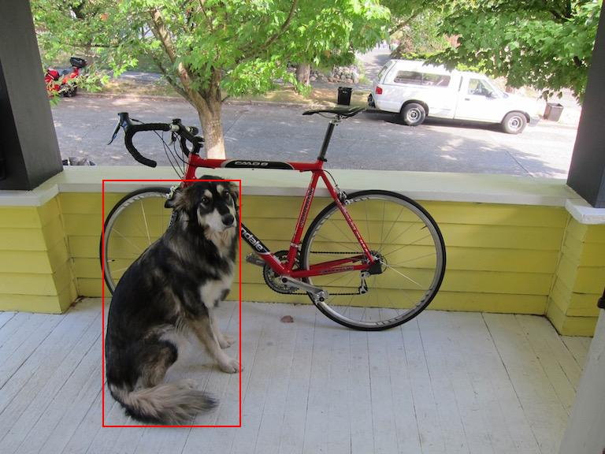
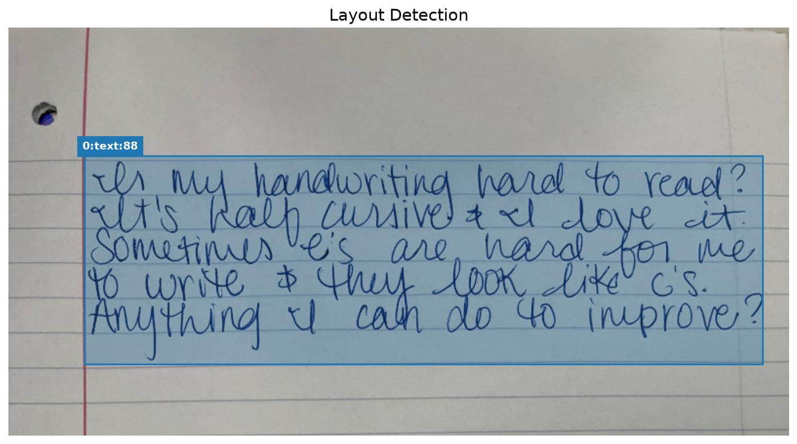

# [Falcon Perception][]

[Falcon Perception]: https://github.com/tiiuae/falcon-perception

[Falcon Perception][] 是一种原生多模态、稠密自回归的 Transformer 模型，能够根据自然语言查询执行目标检测、实例分割或 OCR 任务。

- 体验: https://vision.falcon.aidrc.tii.ae/

## 环境

准备 Conda 环境，

```bash
conda create -n falcon python=3.12 -y
conda activate falcon

# Install PyTorch with CUDA (version <= nvidia-smi shown)
#  https://pytorch.org/get-started/locally
pip install torch torchvision --index-url https://download.pytorch.org/whl/cu128
```

准备 Falcon-Perception，

```bash
git clone --depth 1 https://github.com/tiiuae/Falcon-Perception.git
cd Falcon-Perception
pip install -e .
```

## 推理

### Perception (detection / segmentation)

运行，

```bash
cd start-deep-learning/
export HF_ENDPOINT=https://hf-mirror.com

python practice/Falcon-Perception/perception.py \
--image "data/dog.jpg" --task detection --query "dog" --out-dir result \
--dtype bfloat16 --max-image-size 256 --max-seq-length 2048 \
--flex-attn-safe --no-cudagraph
```

结果，

```bash
Loading model from Hugging Face Hub ...

Image : 768 x 576
Task  : detection
Query : 'dog'
Warmup ...

Warmup done in 20.0s
Running inference ...

Scheduler:
  max_decode_steps_between_prefills: 16

Time statistics by step type:

decode:
  Count: 4
  Total: 0.9796s
  Mean:  0.2449s
  Min:   0.2399s
  Max:   0.2492s

prefill+upsampler:
  Count: 1
  Total: 0.4288s
  Mean:  0.4288s
  Min:   0.4288s
  Max:   0.4288s

Total time: 1.4084s

Scheduling metrics:
  Avg decode batch size: 1.0
  Total preemptions:     0
  Prefill steps:         1
  Prefill samples/step:  min=1, mean=1.0, max=1
  Prefill tokens/step:   min=209, mean=209, max=209
  Decode run lengths:    min=4, mean=4.0, max=4  (n=1 runs)

CUDA memory (peak):
  allocated: 4.94 GiB
  reserved:  4.96 GiB

============================================================
Results
============================================================
  Infer time : 1409 ms
  Prefill    : 410 ms
  Decode     : 978 ms (4 steps)
  Finalize   : 0 ms
  Boxes      : 1
  Decoded    : '<|presence|><|coord|><|size|><|seg|><|end_of_query|>'
[plot] Saved result/boxes/000_dog.jpg

Outdir : result
```



### OCR (text extraction)

#### ocr_plain

全页 OCR (低延迟, 文本不密集时推荐)

运行，

```bash
cd start-deep-learning/
export HF_ENDPOINT=https://hf-mirror.com

python practice/Falcon-Perception/ocr.py \
--image data/handwriting.jpg --task ocr_plain --out-dir result \
--dtype bfloat16 --max-image-size 512 --max-seq-length 4096 \
--n-pages 32 --page-size 128 \
--flex-attn-safe --no-cudagraph
```

结果，

```bash
Loading model from Hugging Face Hub ...

Image    : 800 x 419
Task     : ocr_plain
Category : text
Warmup ...

Warmup done in 31.2s
Running inference ...

============================================================
Results
============================================================
  Infer time : 11111 ms
============================================================
In my handwriting hard to read? It's half cursive & I love it. Sometimes it's are hard for me to write & they look like c's. Anything I can do to improve?

Output : result
```

#### ocr_layout

版面分析 + 区域级 OCR (密集文本/复杂版面推荐)

运行，

```bash
pip install "falcon-perception[ocr]"
pip install matplotlib

python -c "from transformers import AutoModelForObjectDetection; m = AutoModelForObjectDetection.from_pretrained('PaddlePaddle/PP-DocLayoutV3_safetensors')"

python practice/Falcon-Perception/ocr.py \
--image data/handwriting.jpg --task ocr_layout --out-dir result \
--dtype bfloat16 --max-image-size 512 --max-seq-length 4096 \
--n-pages 32 --page-size 128 \
--flex-attn-safe --no-cudagraph
```

结果，

```bash
Loading model from Hugging Face Hub ...

Image    : 800 x 419
Task     : ocr_layout
Category : text
Warmup ...

Warmup done in 33.3s
Running inference ...

============================================================
Results
============================================================
  Infer time : 17632 ms
  Regions    : 1
============================================================
  [0] text  score=0.889  In my handwriting hard to read? It's half cursive & I love it. Sometimes it's ar...

In my handwriting hard to read? It's half cursive & I love it. Sometimes it's are hard for me to write & they look like c's. Anything I can do to improve?
  Layout vis : result/layout.jpg

Output : result
```


