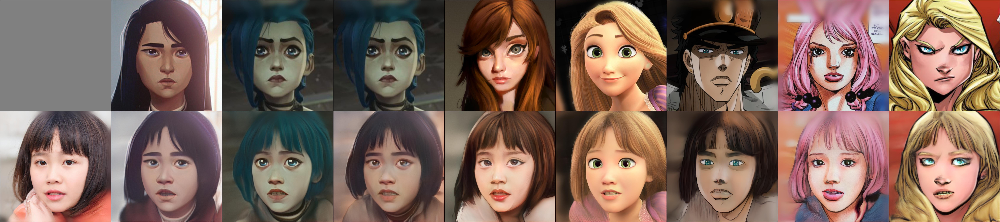
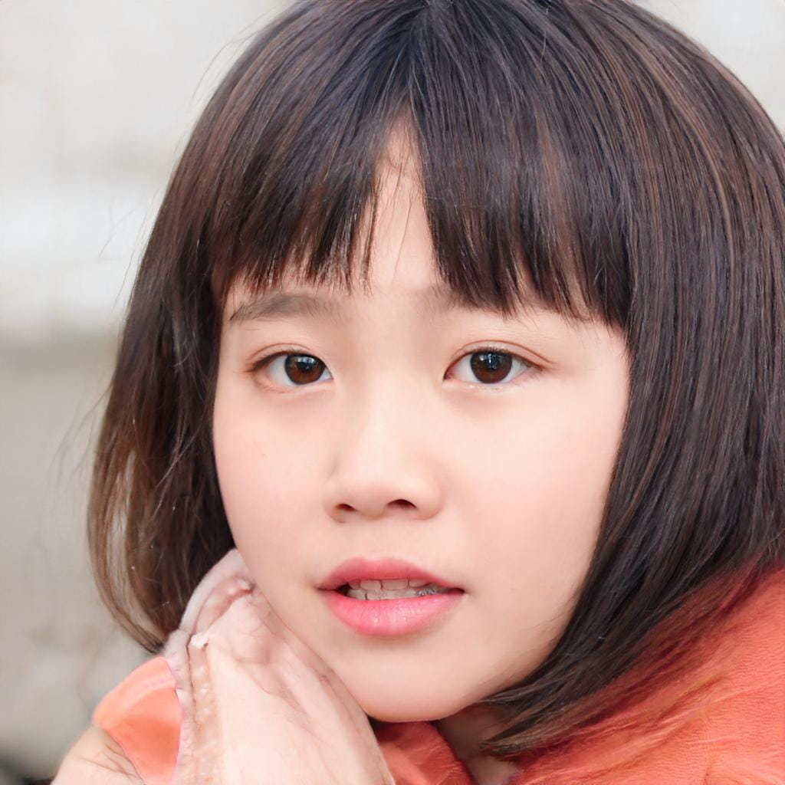
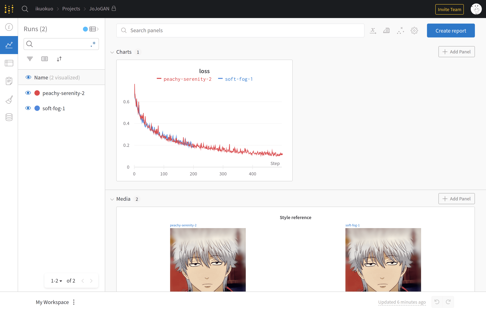
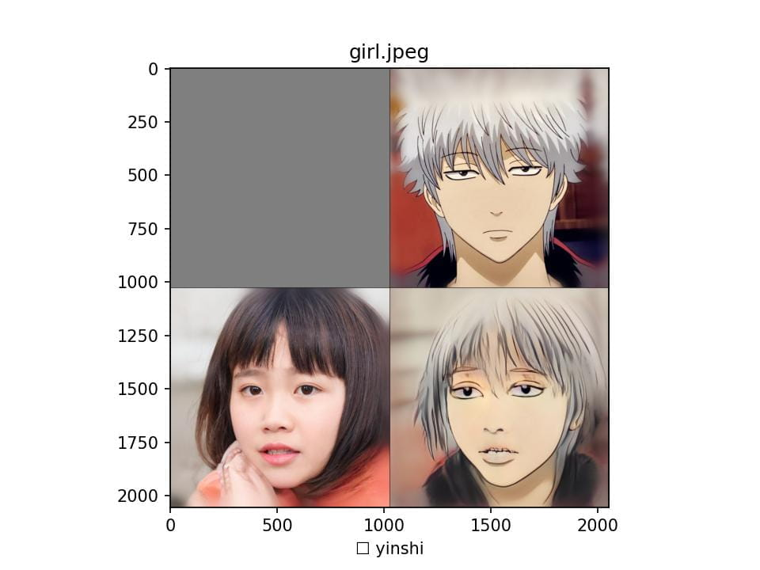

# [JoJoGAN][]

[JoJoGAN]: https://github.com/mchong6/JoJoGAN

JoJoGAN: One Shot Face Stylization



## Environment

- [Anaconda](https://www.anaconda.com/products/individual)
- [PyTorch](https://pytorch.org/get-started/locally/)

```bash
conda create -n torch python=3.9 -y
conda activate torch

conda install pytorch torchvision torchaudio cudatoolkit=11.3 -c pytorch -y
```

```bash
$ python - <<EOF
import torch, torchvision
print(torch.__version__, torch.cuda.is_available())
EOF
1.10.1 True
```

## Installation

```bash
git clone https://github.com/mchong6/JoJoGAN.git
cd JoJoGAN

pip install tqdm gdown matplotlib scipy opencv-python dlib lpips wandb

# Ninja is required to load C++ extensions
wget https://github.com/ninja-build/ninja/releases/download/v1.10.2/ninja-linux.zip
sudo unzip ninja-linux.zip -d /usr/local/bin/
sudo update-alternatives --install /usr/bin/ninja ninja /usr/local/bin/ninja 1 --force
```

Copy `*.py` scripts into `JoJoGAN/`.

## Run these scripts

### [download_models.py](download_models.py)

```bash
python download_models.py
```

```bash
models/
├── arcane_caitlyn_preserve_color.pt
├── arcane_caitlyn.pt
├── arcane_jinx_preserve_color.pt
├── arcane_jinx.pt
├── arcane_multi_preserve_color.pt
├── arcane_multi.pt
├── art.pt
├── disney_preserve_color.pt
├── disney.pt
├── dlibshape_predictor_68_face_landmarks.dat
├── e4e_ffhq_encode.pt
├── jojo_preserve_color.pt
├── jojo.pt
├── jojo_yasuho_preserve_color.pt
├── jojo_yasuho.pt
├── restyle_psp_ffhq_encode.pt
├── stylegan2-ffhq-config-f.pt
├── supergirl_preserve_color.pt
└── supergirl.pt
```

### [generate_faces.py](generate_faces.py)

```bash
python generate_faces.py -s 2000 -o input
```

<!--

-->

### [stylize.py](stylize.py)

```bash
python stylize.py -i test_input/iu.jpeg -s all --save-all --show-all

find ./input -type f -print0 | xargs -0 -i python stylize.py -i {} -s all --save-all
```

### [train.py](train.py)

```bash
python train.py -n yinshi -i style_images/yinshi.jpeg --alpha 1.0 --num_iter 500 --latent_dim 512 --use_wandb --log_interval 50
```


```bash
python stylize.py -i input/girl.jpeg --save-all --show-all --test_style yinshi --test_ckpt output/yinshi.pt --test_ref output/yinshi/style_images_aligned/yinshi.png
```




