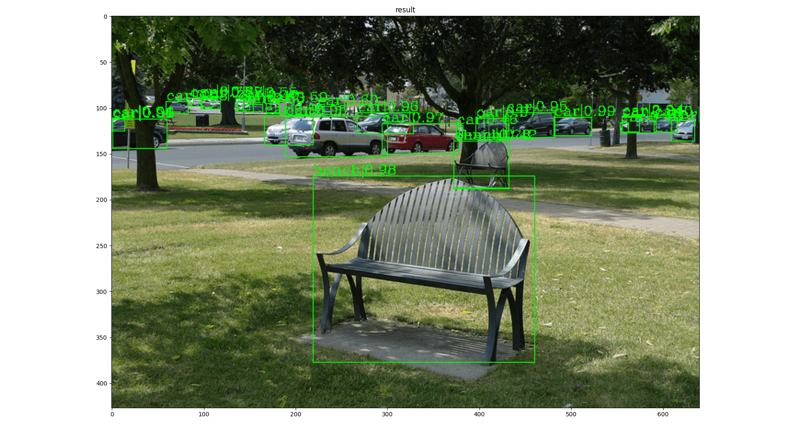
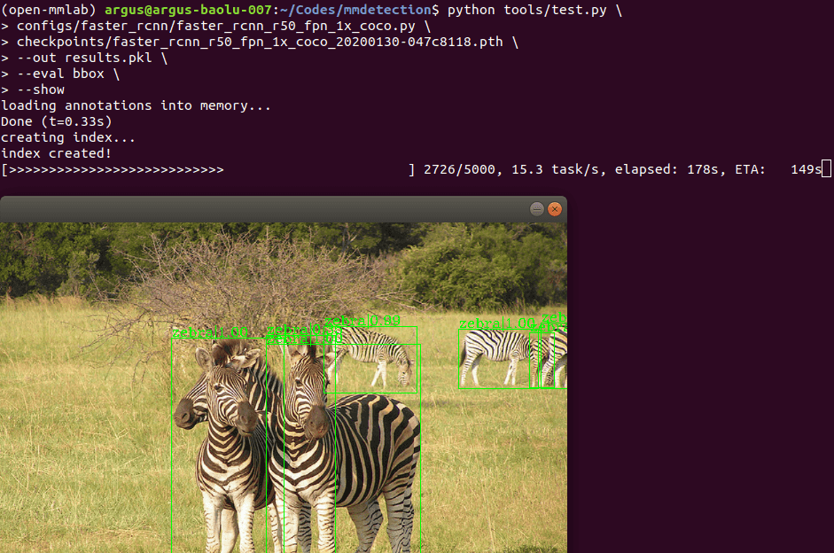
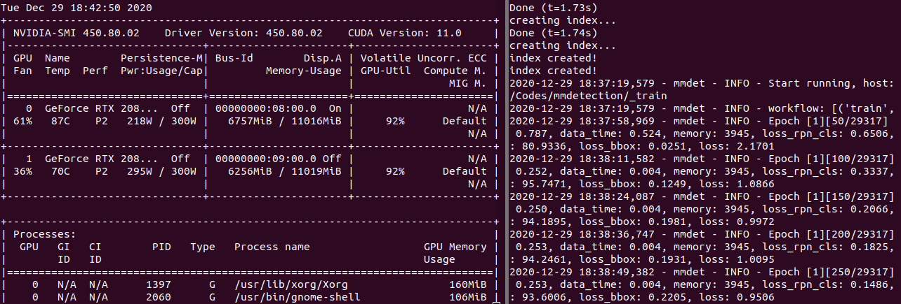

# [MMDetection][]

[MMDetection]: https://github.com/open-mmlab/mmdetection

## Installation

```bash
conda create -n open-mmlab python=3.7 -y
conda activate open-mmlab

conda install pytorch==1.6.0 torchvision==0.7.0 cudatoolkit=10.2 -c pytorch -y

# install the latest mmcv
pip install mmcv-full -f https://download.openmmlab.com/mmcv/dist/cu102/torch1.6.0/index.html

# install mmdetection
git clone https://github.com/open-mmlab/mmdetection.git
cd mmdetection
pip install -r requirements/build.txt
pip install -v -e .
```

Install with `pytorch==1.7.0` (not recommended now because of train error with multi gpu, see this issue: https://github.com/pytorch/pytorch/issues/47050),

```bash
conda install pytorch==1.7.0 torchvision==0.8.1 cudatoolkit=10.2 -c pytorch -y

pip install mmcv-full -f https://download.openmmlab.com/mmcv/dist/cu102/torch1.7.0/index.html
```

- [MMDetection - Installation](https://mmdetection.readthedocs.io/en/latest/get_started.html#installation)
- [MMCV - Installation](https://mmcv.readthedocs.io/en/latest/index.html#installation)

## Inference with existing models

### [Faster RCNN](https://github.com/open-mmlab/mmdetection/tree/master/configs/faster_rcnn)

- configuration file: [faster_rcnn_r50_fpn_1x_coco.py](https://github.com/open-mmlab/mmdetection/blob/master/configs/faster_rcnn/faster_rcnn_r50_fpn_1x_coco.py)
- checkpoint file: [faster_rcnn_r50_fpn_1x_coco_20200130-047c8118.pth](http://download.openmmlab.com/mmdetection/v2.0/faster_rcnn/faster_rcnn_r50_fpn_1x_coco/faster_rcnn_r50_fpn_1x_coco_20200130-047c8118.pth)

```bash
conda activate open-mmlab

cd mmdetection/

python demo/image_demo.py \
demo/demo.jpg \
configs/faster_rcnn/faster_rcnn_r50_fpn_1x_coco.py \
checkpoints/faster_rcnn_r50_fpn_1x_coco_20200130-047c8118.pth
```



<!--
scp checkpoints/faster_rcnn_r50_fpn_1x_coco_20200130-047c8118.pth remote@0.0.0.0:/tmp/
-->

## Test existing models on standard datasets

### Prepare datasets

```bash
cd mmdetection/
mkdir -p data
ln -s ~/datasets/coco2017 data/coco
```

```bash
mmdetection
├── data
│   ├── coco
│   │   ├── annotations
│   │   ├── train2017
│   │   ├── val2017
│   │   ├── test2017
```

### Test existing models

```bash
cd mmdetection/

# single-gpu testing
python tools/test.py \
configs/faster_rcnn/faster_rcnn_r50_fpn_1x_coco.py \
checkpoints/faster_rcnn_r50_fpn_1x_coco_20200130-047c8118.pth \
--out results.pkl \
--eval bbox \
--show

# multi-gpu testing
bash tools/dist_test.sh \
configs/faster_rcnn/faster_rcnn_r50_fpn_1x_coco.py \
checkpoints/faster_rcnn_r50_fpn_1x_coco_20200130-047c8118.pth \
2 \
--out results.pkl \
--eval bbox
```



```bash
python tools/test.py \
> configs/faster_rcnn/faster_rcnn_r50_fpn_1x_coco.py \
> checkpoints/faster_rcnn_r50_fpn_1x_coco_20200130-047c8118.pth \
> --out results.pkl \
> --eval bbox \
> --show
loading annotations into memory...
Done (t=0.33s)
creating index...
index created!
[>>>>>>>>>>>>>>>>>>>>>>>>>>>>>>>>>>>>>>>>>>>>>>>>>>] 5000/5000, 15.3 task/s, elapsed: 328s, ETA:     0s
writing results to results.pkl

Evaluating bbox...
Loading and preparing results...
DONE (t=0.89s)
creating index...
index created!
Running per image evaluation...
Evaluate annotation type *bbox*
DONE (t=26.17s).
Accumulating evaluation results...
DONE (t=4.10s).
Average Precision  (AP) @[ IoU=0.50:0.95 | area=   all | maxDets=100 ] = 0.374
Average Precision  (AP) @[ IoU=0.50      | area=   all | maxDets=1000 ] = 0.581
Average Precision  (AP) @[ IoU=0.75      | area=   all | maxDets=1000 ] = 0.404
Average Precision  (AP) @[ IoU=0.50:0.95 | area= small | maxDets=1000 ] = 0.212
Average Precision  (AP) @[ IoU=0.50:0.95 | area=medium | maxDets=1000 ] = 0.410
Average Precision  (AP) @[ IoU=0.50:0.95 | area= large | maxDets=1000 ] = 0.481
Average Recall     (AR) @[ IoU=0.50:0.95 | area=   all | maxDets=100 ] = 0.517
Average Recall     (AR) @[ IoU=0.50:0.95 | area=   all | maxDets=300 ] = 0.517
Average Recall     (AR) @[ IoU=0.50:0.95 | area=   all | maxDets=1000 ] = 0.517
Average Recall     (AR) @[ IoU=0.50:0.95 | area= small | maxDets=1000 ] = 0.326
Average Recall     (AR) @[ IoU=0.50:0.95 | area=medium | maxDets=1000 ] = 0.557
Average Recall     (AR) @[ IoU=0.50:0.95 | area= large | maxDets=1000 ] = 0.648
OrderedDict([('bbox_mAP', 0.374), ('bbox_mAP_50', 0.581), ('bbox_mAP_75', 0.404), ('bbox_mAP_s', 0.212), ('bbox_mAP_m', 0.41), ('bbox_mAP_l', 0.481), ('bbox_mAP_copypaste', '0.374 0.581 0.404 0.212 0.410 0.481')])
```

## Train predefined models on standard datasets

### Prepare datasets

See same section above for details.

### Change the learning rate in config files

View `configs/faster_rcnn/faster_rcnn_r50_fpn_1x_coco.py`:

```py
_base_ = [
    '../_base_/models/faster_rcnn_r50_fpn.py',
    '../_base_/datasets/coco_detection.py',
    '../_base_/schedules/schedule_1x.py', '../_base_/default_runtime.py'
]
```

View `configs/_base_/schedules/schedule_1x.py`:

```py
# optimizer
optimizer = dict(type='SGD', lr=0.02, momentum=0.9, weight_decay=0.0001)
optimizer_config = dict(grad_clip=None)
# learning policy
lr_config = dict(
    policy='step',
    warmup='linear',
    warmup_iters=500,
    warmup_ratio=0.001,
    step=[8, 11])
total_epochs = 12
```

- `lr=0.01` for 4 GPUs * 2 imgs/gpu
- `lr=0.02` for 8 GPUs and 2 img/gpu (batch size = 8*2 = 16), DEFAULT
- `lr=0.08` for 16 GPUs * 4 imgs/gpu

Change `lr` in `configs/faster_rcnn/faster_rcnn_r50_fpn_1x_coco.py`:

```py
_base_ = [
    '../_base_/models/faster_rcnn_r50_fpn.py',
    '../_base_/datasets/coco_detection.py',
    '../_base_/schedules/schedule_1x.py', '../_base_/default_runtime.py'
]
# optimizer
optimizer = dict(type='SGD', lr=0.005, momentum=0.9, weight_decay=0.0001)
```

- `lr=0.005` for 2 GPUs * 2 imgs/gpu

### Train predefined models

```bash
cd mmdetection/

# single-gpu training
python tools/train.py \
configs/faster_rcnn/faster_rcnn_r50_fpn_1x_coco.py \
--work-dir _train

# multi-gpu training
bash ./tools/dist_train.sh \
configs/faster_rcnn/faster_rcnn_r50_fpn_1x_coco.py \
2 \
--work-dir _train
```



## Train with customized datasets

### Prepare the customized dataset

- [Pascal VOC](http://host.robots.ox.ac.uk/pascal/VOC/)

Convert PASCAL VOC dataset to COCO format, keep only images with cat class presented:

```bash
conda activate open-mmlab

# Dataset Management Framework (Datumaro)
pip install 'git+https://github.com/openvinotoolkit/datumaro'
# pip install tensorflow

datum convert --input-format voc --input-path ~/datasets/VOC2012 \
--output-format coco --output-dir ~/datasets/coco_voc2012_cat \
--filter '/item[annotation/label="cat"]'
```

### Prepare a config

Add `configs/voc_cat/faster_rcnn_r50_fpn_1x_voc_cat.py`:

```py
# The new config inherits a base config to highlight the necessary modification
_base_ = [
    '../_base_/models/faster_rcnn_r50_fpn.py',
    '../_base_/datasets/coco_detection.py',
    '../_base_/schedules/schedule_1x.py', '../_base_/default_runtime.py'
]

# We also need to change the num_classes in head to match the dataset's annotation
model = dict(
    roi_head=dict(
        bbox_head=dict(num_classes=1)))

# Modify dataset related settings
dataset_type = 'COCODataset'
classes = ('cat',)
data_root = '/home/john/datasets/'
data = dict(
    train=dict(
        img_prefix=data_root + 'VOC2012/JPEGImages/',
        classes=classes,
        ann_file=data_root + 'coco_voc2012_cat/annotations/instances_train.json'),
    val=dict(
        img_prefix=data_root + 'VOC2012/JPEGImages/',
        classes=classes,
        ann_file=data_root + 'coco_voc2012_cat/annotations/instances_val.json'),
    test=dict(
        img_prefix=data_root + 'VOC2012/JPEGImages/',
        classes=classes,
        ann_file=data_root + 'coco_voc2012_cat/annotations/instances_val.json'))
evaluation = dict(interval=100)

# Modify schedule related settings
optimizer = dict(type='SGD', lr=0.005, momentum=0.9, weight_decay=0.0001)
total_epochs = 10000

# Modify runtime related settings
checkpoint_config = dict(interval=100)

# We can use the pre-trained model to obtain higher performance
# load_from = 'checkpoints/*.pth'
```

### Train, test, inference models on the customized dataset

#### Train a new model

```bash
# single-gpu training
python tools/train.py \
configs/voc_cat/faster_rcnn_r50_fpn_1x_voc_cat.py \
--work-dir _train_voc_cat

# multi-gpu training
bash ./tools/dist_train.sh \
configs/voc_cat/faster_rcnn_r50_fpn_1x_voc_cat.py \
2 \
--work-dir _train_voc_cat
```

Resume the training process that is interrupted accidentally,

```bash
bash ./tools/dist_train.sh \
configs/voc_cat/faster_rcnn_r50_fpn_1x_voc_cat.py \
2 \
--work-dir _train_voc_cat \
--resume-from _train_voc_cat/epoch_100.pth
```

Solution `ModuleNotFoundError: No module named 'pycocotools'`:

```bash
pip uninstall pycocotools mmpycocotools
pip install mmpycocotools
```

#### Plot training loss

```bash
pip install seaborn

python tools/analyze_logs.py plot_curve \
_train_voc_cat/*.log.json \
--keys loss_cls loss_bbox \
--legend loss_cls loss_bbox
```

#### Test and inference

```bash
# single-gpu testing
python tools/test.py \
configs/voc_cat/faster_rcnn_r50_fpn_1x_voc_cat.py \
_train_voc_cat/latest.pth \
--out results.pkl \
--eval bbox \
--show

# multi-gpu testing
bash tools/dist_test.sh \
configs/voc_cat/faster_rcnn_r50_fpn_1x_voc_cat.py \
_train_voc_cat/latest.pth \
2 \
--out results.pkl \
--eval bbox
```
