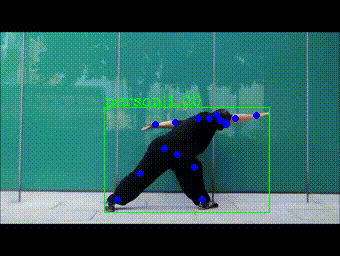
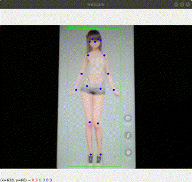

# [MMSkeleton][]

[MMSkeleton]: https://github.com/open-mmlab/mmskeleton

## Installation

- [MMDetection](../MMDetection/README.md)

```bash
conda activate open-mmlab

git clone https://github.com/open-mmlab/mmskeleton.git
cd mmskeleton

# install mmskeleton
python setup.py develop

# install nms for person estimation
cd mmskeleton/ops/nms/
python setup_linux.py develop
cd ../../../
```

## Test existing model on video

### Config

`configs/pose_estimation/pose_demo.yaml`:

```yaml
processor_cfg:
  video_file: resource/data_example/ta_chi.mp4
  detection_cfg:
    model_cfg: ../mmdetection/configs/cascade_rcnn/cascade_rcnn_r50_fpn_1x_coco.py
    checkpoint_file: ../mmdetection/checkpoints/cascade_rcnn_r50_fpn_1x_coco_20200316-3dc56deb.pth
    bbox_thre: 0.8
```

- Cascade R-CNN, R-50-FPN, 1x
  - [config](https://github.com/open-mmlab/mmdetection/tree/master/configs/cascade_rcnn/cascade_rcnn_r50_fpn_1x_coco.py)
  - [model](http://download.openmmlab.com/mmdetection/v2.0/cascade_rcnn/cascade_rcnn_r50_fpn_1x_coco/cascade_rcnn_r50_fpn_1x_coco_20200316-3dc56deb.pth)

### Run

```bash
# verify that mmskeleton and mmdetection installed correctly
# python mmskl.py pose_demo [--gpus $GPUS]
python mmskl.py pose_demo --gpus 1
```

Result will be saved to `work_dir/pose_demo/ta_chi.mp4`.



## Test existing model on webcam

### Config

`configs/apis/pose_estimator.cascade_rcnn+hrnet.yaml`:

```yaml
detection_cfg:
  model_cfg: mmdetection/configs/cascade_rcnn/cascade_rcnn_r50_fpn_1x_coco.py
  checkpoint_file: mmdetection/checkpoints/cascade_rcnn_r50_fpn_1x_coco_20200316-3dc56deb.pth
  bbox_thre: 0.8
estimation_cfg:
  model_cfg: mmskeleton/configs/pose_estimation/hrnet/pose_hrnet_w32_256x192_test.yaml
  checkpoint_file: mmskeleton://pose_estimation/pose_hrnet_w32_256x192
  data_cfg:
    image_size:
      - 192
      - 256
    pixel_std: 200
    image_mean:
      - 0.485
      - 0.456
      - 0.406
    image_std:
      - 0.229
      - 0.224
      - 0.225
    post_process: true
```

### Coding

[webcam.py](webcam.py):

```py
def main():
  args = parse_args()

  win_name = args.win_name
  cv.namedWindow(win_name, cv.WINDOW_NORMAL)

  with Camera(args.cam_idx, args.cam_width, args.cam_height, args.cam_fps) as cam:
    cfg = mmcv.Config.fromfile(args.cfg_file)
    detection_cfg = cfg["detection_cfg"]

    print("Loading model ...")
    model = init_pose_estimator(**cfg, device=0)
    print("Loading model done")

    for frame in cam.reads():
      res = inference_pose_estimator(model, frame)

      res_image = pose_demo.render(
          frame, res["joint_preds"], res["person_bbox"],
          detection_cfg.bbox_thre)

      cv.imshow(win_name, res_image)

      key = cv.waitKey(1) & 0xFF
      if key == 27 or key == ord("q"):
        break

  cv.destroyAllWindows()
```

### Run

```bash
$ python webcam.py \
--cam_idx 2 --cam_width 640 --cam_height 480 --cam_fps 10 \
--cfg_file configs/apis/pose_estimator.cascade_rcnn+hrnet.yaml
Args
  win_name: webcam
  cam_idx: 2
  cam_width: 640
  cam_height: 480
  cam_fps: 10
  cfg_file: configs/apis/pose_estimator.cascade_rcnn+hrnet.yaml
CAM: 640.0x480.0 10.0
Loading model ...
Loading model done
```


