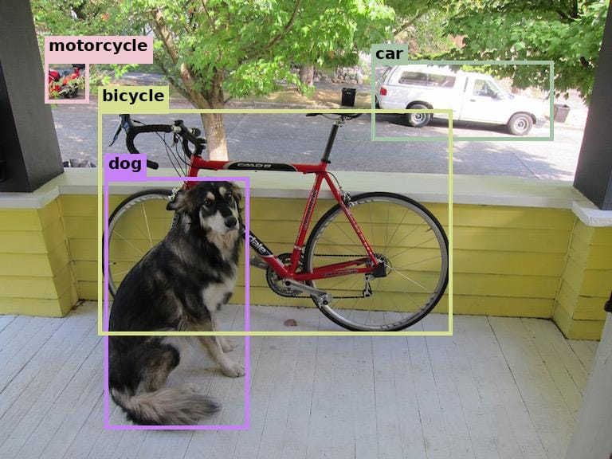

# [Rex-Omni][]

[Rex-Omni]: https://github.com/IDEA-Research/Rex-Omni

[Rex-Omni][] 是一个 3B 参数多模态模型，它将视觉感知任务（包括物体检测、OCR、指向、关键点定位和视觉提示）统一到一个单一的下一点预测框架中。

- 体验: https://rex-omni.github.io/

## 环境

准备 Conda 环境，

```bash
conda create -n rexomni python=3.10 -y
conda activate rexomni

# Install PyTorch (CPU version)
pip install torch torchvision
# Install PyTorch with CUDA (version <= nvidia-smi shown)
#  https://pytorch.org/get-started/locally
pip install torch==2.7.0 torchvision --index-url https://download.pytorch.org/whl/cu128
```

准备 Rex-Omni，

```bash
git clone --depth 1 https://github.com/IDEA-Research/Rex-Omni.git
cd Rex-Omni
pip install -r requirements.txt
pip install -v -e .
```

如遇 flash-attn 安装错误，

```bash
# 编译安装 flash-attn
#  https://github.com/dao-ailab/flash-attention
conda install -c nvidia cuda=12.8
# pip install -U pip setuptools
pip install packaging psutil ninja
MAX_JOBS=4 pip install flash-attn --no-build-isolation

# 或直接安装预编译的 flash-attn
wget https://github.com/Dao-AILab/flash-attention/releases/download/v2.7.4.post1/flash_attn-2.7.4.post1+cu12torch2.7cxx11abiTRUE-cp310-cp310-linux_x86_64.whl
pip install ./flash_attn-*.whl

# 检查 flash-attn 版本
#  Rex-Omni: flash-attn==2.7.4.post1
#  xformers: flash-attn>=2.7.1,<=2.7.4
python -c "import flash_attn; print(flash_attn.__version__)"
```

<!--
pip install uv
pip install -r requirements.txt
-->

## 推理

```bash
# Use model: Rex-Omni-AWQ, not Rex-Omni
#  vLLM params adjusted to reduce HBM usage
HF_ENDPOINT=https://hf-mirror.com python practice/Rex-Omni/infer_awq.py
# HF_ENDPOINT=https://hf-mirror.com python practice/Rex-Omni/infer.py

# Notice:
#  Cannot use FlashAttention-2 backend for Volta and Turing GPUs
```

结果，

```bash
Infer time: 5577.527 ms
{
  "success": true,
  "image_size": [
    768,
    576
  ],
  "resized_size": [
    756,
    588
  ],
  "task": "detection",
  "prompt": "Detect dog, car, bicycle, motorcycle. Output the bounding box coordinates in [x0, y0, x1, y1] format.",
  "raw_output": " <|object_ref_start|> dog <|object_ref_end|> <|box_start|> <171> <386> <407> <934> <|box_end|> ,  <|object_ref_start|> car <|object_ref_end|> <|box_start|> <607> <132> <904> <306> <|box_end|> ,  <|object_ref_start|> bicycle <|object_ref_end|> <|box_start|> <161> <238> <738> <729> <|box_end|> ,  <|object_ref_start|> motorcycle <|object_ref_end|> <|box_start|> <73> <130> <145> <224> <|box_end|>",
  "extracted_predictions": {
    "dog": [
      {
        "type": "box",
        "coords": [
          131.45945945945945,
          222.55855855855856,
          312.88888888888886,
          538.5225225225225
        ]
      }
    ],
    "car": [
      {
        "type": "box",
        "coords": [
          466.6426426426426,
          76.1081081081081,
          694.966966966967,
          176.43243243243242
        ]
      }
    ],
    "bicycle": [
      {
        "type": "box",
        "coords": [
          123.77177177177177,
          137.22522522522522,
          567.3513513513514,
          420.3243243243243
        ]
      }
    ],
    "motorcycle": [
      {
        "type": "box",
        "coords": [
          56.12012012012012,
          74.95495495495496,
          111.47147147147147,
          129.15315315315314
        ]
      }
    ]
  },
  "inference_time": 5.577237844467163,
  "num_output_tokens": 45,
  "num_prompt_tokens": 617,
  "generation_time": 5.567654609680176,
  "tokens_per_second": 8.082397913433956
}
```



## 训练

- [Fine-tuning Guide](https://github.com/IDEA-Research/Rex-Omni/blob/master/finetuning/README.md)
