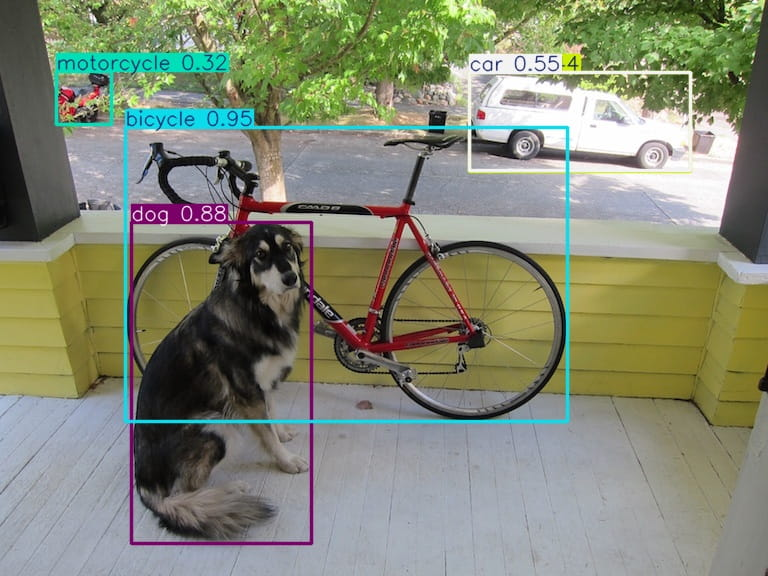

# [YOLO-Master][]

[YOLO-Master]: https://github.com/Tencent/YOLO-Master

[YOLO-Master][]：引入了 ES-MoE，让计算更智能。会依据输入自适应做计算，不再是静态的。

- 体验: https://huggingface.co/spaces/gatilin/YOLO-Master-WebUI-Demo

## 环境

准备 Conda 环境，

```bash
conda create -n yolom python=3.12
conda activate yolom

# Install PyTorch (CPU version)
pip install torch torchvision
# Install PyTorch with CUDA (version <= nvidia-smi shown)
#  https://pytorch.org/get-started/locally
pip install torch torchvision --index-url https://download.pytorch.org/whl/cu130
```

准备 YOLO-Master，

```bash
# Clone the repository
git clone --depth 1 https://github.com/Tencent/YOLO-Master
cd YOLO-Master

# Install dependencies
pip install -r requirements.txt
pip install -e .

# Optional: Install FlashAttention for faster training (CUDA required)
#   https://github.com/Dao-AILab/flash-attention
pip install flash_attn
```

## 准备

```bash
# 获取模型，YOLO-Master-EsMoE-N
wget https://huggingface.co/gatilin/YOLO-Master-ckpts-v0/resolve/main/YOLO-Master-EsMoE-N/YOLO-Master-EsMoE-N.pt?download=true
ln -s YOLO-Master-EsMoE-N.pt yolo_master_n.pt
```

## 验证

```bash
python practice/YOLO-Master/validate.py
```

## 推理

```bash
python practice/YOLO-Master/infer.py
```



## 训练

```bash
python practice/YOLO-Master/train.py
```
