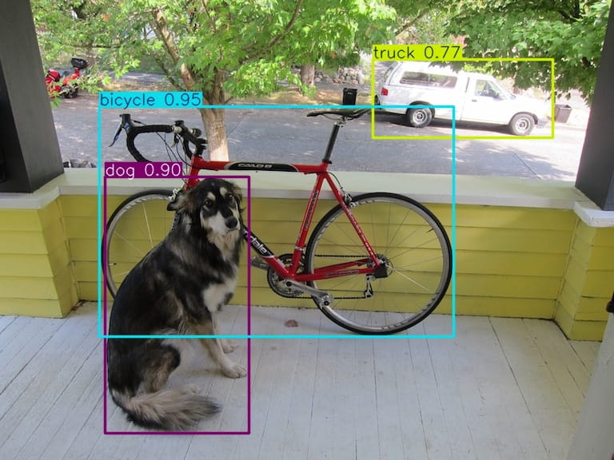

# [YOLO26][]

[YOLO26]: https://docs.ultralytics.com/zh/models/yolo26/

[YOLO26][]：更简化的设计，直接端到端出检测结果。不用再搞后处理了，利于边缘做部署。

- 体验: https://platform.ultralytics.com/ultralytics/yolo26

## 环境

准备 Conda 环境，

```bash
conda create -n yolo26 python=3.12
conda activate yolo26

# Install PyTorch (CPU version)
pip install torch torchvision
# Install PyTorch with CUDA (version <= nvidia-smi shown)
#  https://pytorch.org/get-started/locally
pip install torch torchvision --index-url https://download.pytorch.org/whl/cu130
```

准备 YOLO26，

```bash
# Install ultralytics package
pip install -U ultralytics

# Install dependencies
pip install faster-coco-eval
```

## 验证

```bash
python practice/YOLO26/validate.py
```

## 推理

```bash
python practice/YOLO26/infer.py
```



## 训练

```bash
python practice/YOLO26/train.py
```
